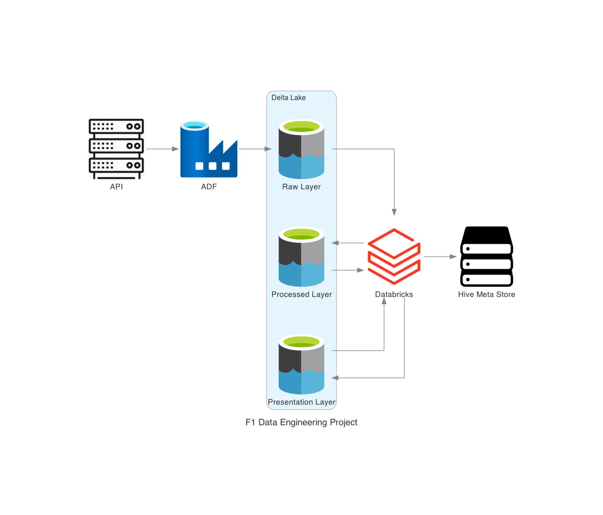

# Formula1 Data Engineering Project

>Main goal of this project was to create a data pipeline that would allow to collect Formula1 data from the API, store it in a database and then be able to use it to various analysis.

## Overview

### Dataset used
Dataset was gathered from the Ergast API, which is a RESTful API that provides historical Formula 1 data. The API provides data from the beginning of the world championships in 1950. The API is available at http://ergast.com/mrd/ and it is free to use.
Ergast provides few collection that can be used to gather data. For this project I used the following collections: races, results, circuits, drivers, constructions

### Data Pipeline
Data pipeline was created using Azure Data Factory. It consists of 3 main steps:
- [Data gather](pipeline/Formula1%20Data%20Copy.json) - data is gathered from the API and stored in Azure Data Lake Storage Gen2 in raw layer
  - Pipeline consist of five 'Copy data' blocks that each gather data from one of the Ergast API collections and saves it 
  - [Pipeline Screenshot](images/data_gather.png)

- [Data ingestion](pipeline/Formula1%20Data%20Preparation.json) - data is prepared for transformation and stored in Azure Data Lake Storage Gen2 in processed layer
  - Pipeline first call 'Data Copy' pipeline
  - Then 'Get Metadata' block is run to gather info about 'Raw Layer' files
  - Metadata is then passed to 'If condition' that checks if there are any files in 'Raw Layer'. 
  - If there are any files, then we execute 5 activities that each of is Databricks notebook, that contains logic for data preparation
  - Notebooks are:
    - [Circuits Ingestion](notebooks/Circuits%20Ingestion.py) 
    - [Constructors Ingestion](notebooks/Constructors%20Ingestion.py)
    - [Drivers Ingestion](notebooks/Drivers%20Ingestion.py)
    - [Results Ingestion](notebooks/Results%20Ingestion.py)
    - [Races Ingestion](notebooks/Races%20Ingestion.py)
  - After data is process it is put into 'Processed Layer'
  - [Pipeline Screenshot](images/data_prep.png)
  

- [Data transformation](pipeline/Formula1%20Transformation%20Execution.json) - data is transformed and stored first in Azure Data Lake Storage Gen2 in presentation layer and then in Hive Meta Store
  - This is the actual pipeline that contains trigger that execute whole process
  - Trigger is set to run every Monday so right after when new data is available
  - Pipeline first call 'Data Ingestion' pipeline
  - Then ['Transformation race results' notebook](notebooks/Transformation%20Race%20Results.py) is run it contains logic for data joining, selection of columns and saves data to 'Presentation Layer'
  - Then in parallel we run ['Transformation driver standings' notebook](notebooks/Transformation%20Drivers%20Standings.py) and ['Transformation constructors standings' notebook](notebooks/Transformation%20Constructors%20Standings.py) which contains business logic for data aggregation that can be used to make a raport
  - After that ['Save to Hive Meta Store' notebook](notebooks/Save%20to%20Hive%20Meta%20Store.py) is run to save data to Hive Meta Store
  - [Pipeline Screenshot](images/data_transform.png)

### Data Architecture

The chosen stack is based on Microsoft recommendations for Azure Databricks Modern Analytics Architecture. 
More on that [here](https://learn.microsoft.com/en-us/azure/architecture/solution-ideas/media/azure-databricks-modern-analytics-architecture.svg#lightbox) 
As my main goal was to learn Azure Data Factory and Azure Databricks I decided to use this stack.

## Lessons Learned

I learned a lot about Azure Data Factory and Azure Databricks. I also learned how to use Azure Data Factory to orchestrate data pipeline.
I had a chance to use my newly acquired PySpark skills to create data transformation logic.
Overall it was a great first project to learn about data engineering.

## Contact

Please feel free to contact me if you have any questions via [my portfolio page](https://lczerniawski.github.io)
